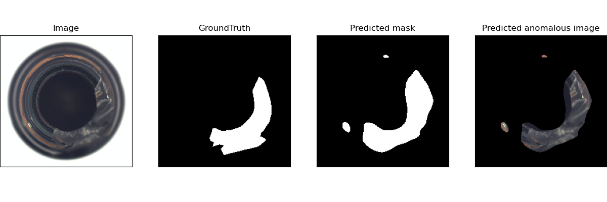

# Anomaly Segmentation in a teacher-guide-student manner

This is a toy example to do anomaly segmentation using a quite simple teacher-student framework. I wrote this project for learning deeplearning and pytorch.  My code is heavily borrowed from this **SPADE-pytorch** project. https://github.com/byungjae89/SPADE-pytorch 

 

The main difference is that here a pretrained vgg16 is used as a teacher, guiding a student network with the same structure to extract features. **The student's regression errors with respect to the teacher in different receptive fields** are combined to yield dense anomaly scores.  

## Requirement
`PyTorch 1.5+`  

## Datasets
MVTec AD datasets https://www.mvtec.com/company/research/datasets/mvtec-ad/

## Code examples

### Step 1. Set the *DATASET_PATH* variable.

Set the [DATASET_PATH](main.py#L022) to the root path of the downloaded MVTec AD dataset.

### Step 2. Train vgg16 student and Test.

`python main.py`

## Discussion
- **evaluation metric** 
**roc_auc_score** is not suitable because of  the extreme imbalance between possitive pixels and negative  pixels. 
**per-region-overlap(PRO)** should be a better evaluation metric in this scenario.

